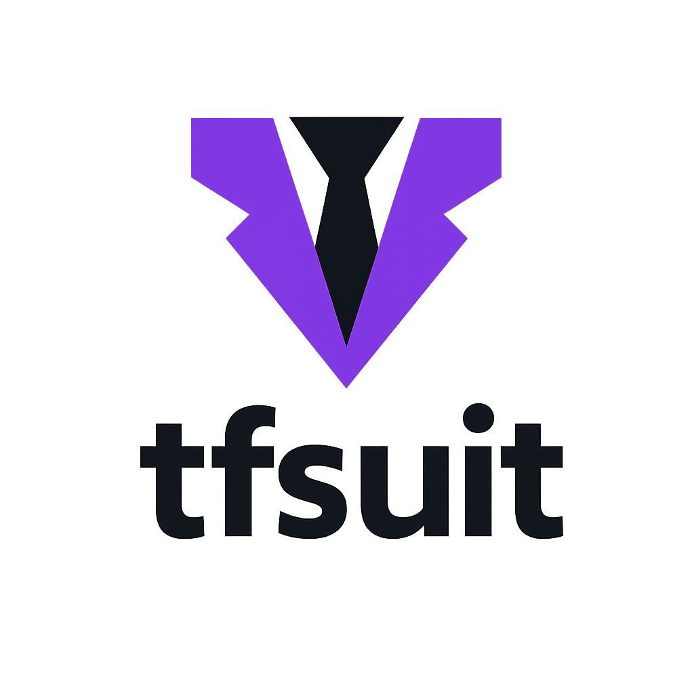

# tfsuit



[](https://github.com/josdagaro/tfsuit/actions/workflows/release.yml) [](https://github.com/josdagaro/tfsuit/actions/workflows/ci.yml) [](https://github.com/josdagaro/tfsuit/actions/workflows/tfsuit.yml)

> **Fast, opinionated Terraform naming linter & fixer – written in Go**

`tfsuit` helps you enforce consistent, organisation‑wide naming rules for every Terraform variable, output, module and resource – in your editor, in CI and in your pull‑requests.

---

## 🎯 Why tfsuit?

- Enforce naming policies once and share them across repos, teams and CI
- Catch inconsistent Terraform labels before they reach review or production
- Auto‑fix issues while keeping cross‑references in sync (no manual renames)
- Integrates with GitHub Actions, SARIF code scanning and editor tooling

---

## ✨ Key features (v1)

|                        | Feature                                                  | Notes                                         |
| ---------------------- | -------------------------------------------------------- | --------------------------------------------- |
| **Ultra‑fast core**    | Go implementation ▶ multi‑CPU parsing, intelligent cache | 10‑50× faster than the original Bash version  |
| **Configurable rules** | HCL or JSON (`tfsuit.hcl`)                               | Per‑type patterns, allow‑lists / ignore‑regex |
| **Linter modes**       | `scan` (read‑only)                                       | Pretty, JSON or SARIF output                  |
| **Auto‑fixer**         | `fix` – rewrites labels, updates all cross‑references    | `--dry-run` to preview, `--write` to apply    |
| **Code Scanning**      | SARIF + GitHub annotations                               | PR checklist + summary comment                |
| **GitHub Action**      | `uses: josdagaro/tfsuit/action@v3`                       | Runs in Docker, no build step                 |
| **Homebrew formula**   | `brew install josdagaro/tfsuit/tfsuit`                   | macOS / Linux                                 |
| **Docker image**       | `ghcr.io/josdagaro/tfsuit:<tag>`                         | Static binary, 6 MiB                          |
| **VS Code extension**  | *Preview*: LSP‑based inline diagnostics & quick‑fix      | Coming soon                                   |

---

## ⚡ Quick start

```bash
# 1. Install
brew install josdagaro/tfsuit/tfsuit

# 2. Drop a config file in your repo root
cat <<'EOF' > tfsuit.hcl
variables { pattern = "^[a-z0-9_]+$" }
resources { pattern = "^[a-z0-9_]+$" }
EOF

# 3. Scan your Terraform project
tfsuit scan ./infra
```

For CI enforcement, use the GitHub Action with `fail: true` to fail the job when violations are found.

---

## 🚀 Installation

### Homebrew (macOS/Linux)

```bash
brew tap josdagaro/tfsuit
brew install tfsuit
```

Update to the latest tagged release:

```bash
brew update
brew upgrade tfsuit
```

Validate your installation:

```bash
tfsuit --version
```

### Binary release

Grab the archive for your OS from the [GitHub Releases](https://github.com/josdagaro/tfsuit/releases) page, extract and move `tfsuit` to a directory on your `$PATH`.

### Docker

```bash
# latest stable
docker run --rm -v "$PWD:/src" ghcr.io/josdagaro/tfsuit:latest scan /src
```

### GitHub Action

Add to your workflow:

```yaml
- uses: josdagaro/tfsuit/action@v3
  with:
    path: ./infra                # directory to scan (default '.')
    config: .github/tfsuit.hcl   # your rule file (default 'tfsuit.hcl')
    format: sarif                # pretty | json | sarif
    fail: true                   # fail the job if violations found
```

The action automatically uploads the SARIF file to GitHub Code Scanning.

---

## 📑 Configuration (`tfsuit.hcl`)

```hcl
variables {
  pattern      = "^[a-z0-9_]+$"
  ignore_exact = ["aws_region"]
}

outputs {
  pattern = "^[a-z0-9_]+$"
}

modules {
  pattern      = "^[a-z0-9_]+(_[a-z]+)?$"
  ignore_regex = [".*experimental.*"]
  require_provider = true
}

resources {
  pattern = "^[a-z0-9_]+$"
  require_provider = false
}

data {
  pattern = "^[a-z0-9_]+$"
  require_provider = false
}

files {
  pattern = "^[a-z0-9_]+\\.tf$"
  ignore_regex = ["locals.*\\.tf"]
}
```

*Compile‑time validation* – invalid regex is caught at startup.

Set `require_provider = true` in any block to ensure Terraform declarations explicitly pin a provider. Modules default to `require_provider = true`, while variables, outputs, resources and data sources default to `false`. Override those defaults in `tfsuit.hcl` when you want the fixer to enforce providers for additional block types, and use the `files` block to constrain every `.tf` filename (for example, enforcing snake_case only). When enabled, `tfsuit` verifies:

```hcl
resource "aws_s3_bucket" "logs" {
  provider = aws.primary
}

data "aws_s3_bucket" "selected" {
  provider = aws.primary
}

module "network" {
  source = "../network"
  providers = {
    aws = aws.primary
  }
}

`tfsuit fix` also injects the most-used provider when one is missing (for example `provider = aws.primary` or a `providers = { aws = aws.primary }` block). If no provider is defined anywhere, the command fails and creates a `providers.tf` with a comment reminding you to declare at least one aliased provider before retrying. The fixer understands the `providers = { ... }` mappings inside `module` blocks, so it can propagate aliases down to nested submodules even when the actual configurations live only at the root.
```

---

## 🧰 Bootstrap config (init)

Generate a starter config from your repository’s current labels and a few interactive choices:

```bash
tfsuit init .
```

Prompts include:
- Allow uppercase / hyphens in labels
- Optional module suffix pattern like `_[a-z]+`
- Suggested `ignore_exact` and `ignore_regex` entries

Writes `tfsuit.hcl` in the selected path (asks before overwriting).

---

## 🔍 CLI usage

```bash
tfsuit scan [path]           # lint only
  -c, --config <file>        # config file (default tfsuit.hcl)
  -f, --format pretty|json|sarif

tfsuit fix [path]            # auto‑fix labels
      -c, --config <file>    # config file (default tfsuit.hcl)
      --dry-run              # show diff
      --write                # apply changes

tfsuit init [path]           # interactive config bootstrap (creates tfsuit.hcl)
```

Example:

```bash
# CI – generate SARIF and upload to Code Scanning
mkdir results
tfsuit scan ./infra --format sarif > results/tfsuit.sarif
```

---

## 🧪 Examples

Given a Terraform resource with a non‑conforming label:

```hcl
resource "aws_s3_bucket" "BadBucket" {
  bucket = "example"
}
```

Scan output (pretty format):

```text
$ tfsuit scan ./infra
infra/main.tf:2:15  resource.aws_s3_bucket.BadBucket  label "BadBucket" does not match "^[a-z0-9_]+$"
```

Auto‑fix and review the change:

```bash
tfsuit fix ./infra --dry-run   # see proposed rename
tfsuit fix ./infra --write     # apply updates to all references
```

The fixer rewrites references (modules, locals, outputs) to keep your code compiling.

---

## 🧩 VS Code (preview)

The upcoming extension provides live diagnostics and `Quick Fix…` to rename variables safely. Watch the [project board](https://github.com/josdagaro/tfsuit/projects/1) for progress.

---

## 🛠 Development

```bash
go vet ./...      # static checks
go test ./...     # unit tests
```

### Prerequisites

- Go 1.24+ (matches `go.mod`)
- (optional) [GoReleaser](https://goreleaser.com) for snapshot packaging

### Build & run locally

```bash
go build ./cmd/tfsuit    # compile binary into current directory
./tfsuit --help          # inspect available commands

go run ./cmd/tfsuit scan ./samples
```

### Test before pushing

```bash
go test ./...
go vet ./...
```

Run the fixer against fixtures to verify behaviour:

```bash
go run ./cmd/tfsuit fix ./samples/simple --dry-run -c ./samples/simple/tfsuit.hcl
go run ./cmd/tfsuit fix ./samples/provider-chain --dry-run -c ./samples/provider-chain/tfsuit.hcl
```

### GoReleaser dry runs

Use snapshot releases to emulate the CI pipeline without publishing artifacts:

```bash
goreleaser release --snapshot --clean
```

The command builds platform packages, Docker image and the Homebrew formula locally so you can spot issues before opening a release PR.

### Release pipeline

- **SemVer** determined from PR label (`major` / `minor` / `patch`).
- **GoReleaser** builds binaries, Docker image, Homebrew formula.
- Tags `vX.Y.Z`, moving tags `vX`, `vX.Y`.

Details in `.github/workflows/release.yml`.

---

## 📜 License

MIT License – see [LICENSE](LICENSE).
